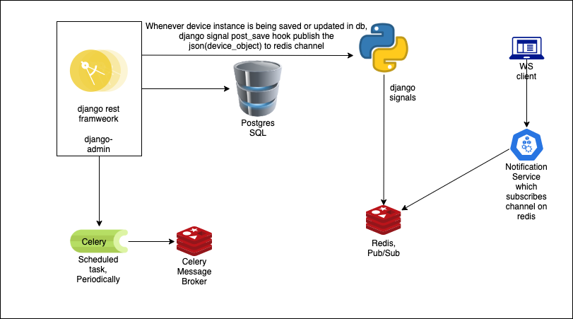

# IOT Devices Real Time Notification Services

## Tech Stack
- [django](https://djangoproject.com/), [djangorestframework](https://djangorestframework.com/),
- [django-signal](https://docs.djangoproject.com/en/3.2/topics/signals/)
- [redis](https://redis.io/), [redis-py](https://github.com/andymccurdy/redis-py)
- [nodejs](https://nodejs.org/en/)

## Requirements
- [Docker](https://www.docker.com/)

## Getting Started
- Clone the repo 
  `git clone https://github.com/mehdirazajaffri/interel-test`
- cd root folder and run `docker-compose up`
- Django Admin (http://localhost:8000/admin)
- Web socket connection `ws://localhost:3000/`

## Architecture

